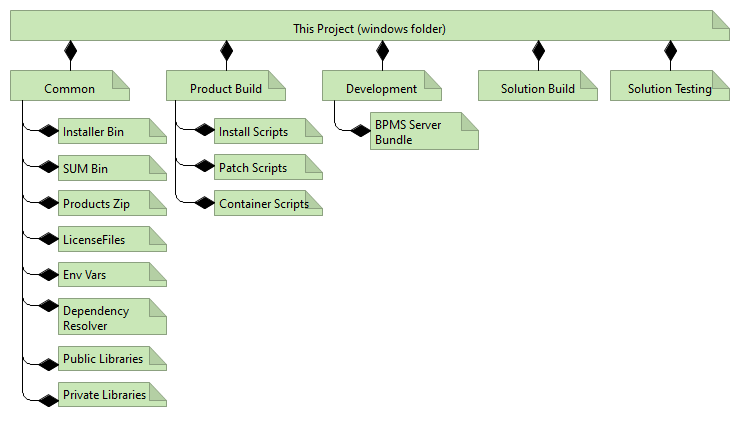

# Content usable from Windows

The content in this folder is intended to be used with a Windows Workstation having the latest version of Docker desktop

Current versions I use are

- Windows 10 Enterprise Version 1909 (main PC) + Docker Desktop 2.3.0.3 (45519)
- Windows 10 Enterprise Version 1909 (secondary testing PC) + Docker Desktop 2.3.0.2 (45183)
- Windows Home 2004 with WSL2 as backend (tertiary testing PC)

## Project prerequisites

Docker Desktop must be allowed to mount the following folders and their subfolders:

- .\windows\common\mount
- .\windows\common\config\secret

## Project organization



## Project Constants

These values are hardwired in the scripts on purpose.

All important scripts will produce output in the run folder, defined in ${RUN_FOLDER}. This is either received or created.

### Linux values

```bash
# software ag products install directory
/opt/softwareag

# software ag update manager home directory
/opt/sagsum

# mount folders home
/mnt

# mysqlce driver
# todo: variabilize this
mysql-connector-java-8.0.15.jar

#downloaded from maven repo

# database server name
mysql

# database server port
3306
```

## Project Conventions and Decisions

- Credentials are always put in files *credentials*. The file ".gitignore" contains this expression.
- All scripting for linux will be done in bash. Powershell may be used, but it is more combersome to use and requires further installations
- Powershell is used for windows scripting by default, bat files are used when the script is very simple or needs "double click" launching
- (2020-07-08): All installations relying on the common osgi framework with 10.5 will have to consider the full /opt/softwareag folder as data, thus mount it. It just mutates too much to track all differences one by one
- All project environment variables are prefixed by SAG_
- All project environment variables valid in Windows (host) shells are prefixed with SAG_W_
- container names will always be prefixed by the project name, same way docker-compose does with networks or volumes. Example: bpms1-mysql
